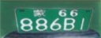
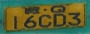
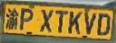
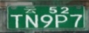

# China-Balanced-License-Plate-Recognition-Dataset-330k

This repository contains the China-Balanced-License-Plate-Recognition-Dataset-330k, a high-quality, balanced dataset of 330,000 images featuring various types of Chinese license plates. The dataset is generated using Generative Adversarial Networks (GANs), ensuring excellent image quality and a balanced distribution of different license plate types. This dataset is perfect for training and evaluating license plate recognition models.

Note: In order to ensure the balance of the characters, there may be some license plate numbers that do not conform to common sense (for example, all letters), but this phenomenon does not affect the training.

<div align="center">
   
</div>
<div align="center">
   
</div>
<div align="center">
   
</div>

## License Plate Characters and Types

The dataset includes the following characters and types of Chinese license plates:
```
    '京', '沪', '津', '渝', '冀', '晋', '蒙', '辽', '吉', '黑',
    '苏', '浙', '皖', '闽', '赣', '鲁', '豫', '鄂', '湘', '粤',
    '桂', '琼', '川', '贵', '云', '藏', '陕', '甘', '青', '宁',
    '新', '港', '澳', '挂', '学', '领', '使', '临',

    '0', '1', '2', '3', '4', '5', '6', '7', '8', '9',
    'A', 'B', 'C', 'D', 'E', 'F', 'G', 'H', 'J', 'K',
    'L', 'M', 'N', 'P', 'Q', 'R', 'S', 'T', 'U', 'V',
    'W', 'X', 'Y', 'Z', 'I', 'O'
```

```
'黑色车牌', '单层黄牌', '双层黄牌', '普通蓝牌', '拖拉机绿牌', '新能源大型车', '新能源小型车'
```

## Dataset Annotation Structure and Format

The dataset is divided into three text files: `data.txt` (all data), `train.txt` (training data), and `val.txt` (validation data). Each line in the text files consists of an image file path, license plate number, and license plate type, separated by spaces. Here's a sample of the dataset structure:
```
CBLPRD-330k/000208356.jpg 云F5MTG学 单层黄牌
CBLPRD-330k/000275202.jpg 湘QSM5FJ 普通蓝牌
CBLPRD-330k/000013734.jpg 晋PND9HJ 黑色车牌
CBLPRD-330k/000351364.jpg 鄂OTBU7Z 单层黄牌
CBLPRD-330k/000223461.jpg 闽FB6RMK 单层黄牌
...
```


## Training Results

The training code is being sorted out, waiting to be supplemented.

## Download

You can download the dataset using the following link: [China-Balanced-License-Plate-Recognition-Dataset-330k Download](https://pan.baidu.com/s/1z_3jeZh2s7BwazY6uJ7Meg?pwd=uptf)

## Future Releases

If this dataset receives significant attention and interest, we will consider releasing even better and larger datasets in the future. Please star and share this repository to support our work!

## QQ Group
Join our QQ group for discussions and support related to this dataset:

QQ Group Number: 572511565

## License
This dataset is released under the [MIT License](./LICENSE).

## Citation
If you use this dataset in your research, please cite our repository:
```
@misc{china-balanced-license-plate-recognition-dataset-330k,
  author = {S L},
  title = {China-Balanced-License-Plate-Recognition-Dataset-330k},
  year = {2023},
  publisher = {GitHub},
  journal = {GitHub Repository},
  howpublished = {\url{https://github.com/SunlifeV/CBLPRD-330k}},
}
```
We hope that this dataset will be helpful for your research and applications in the field of license plate recognition. We look forward to seeing the creative ways in which this dataset will be used.